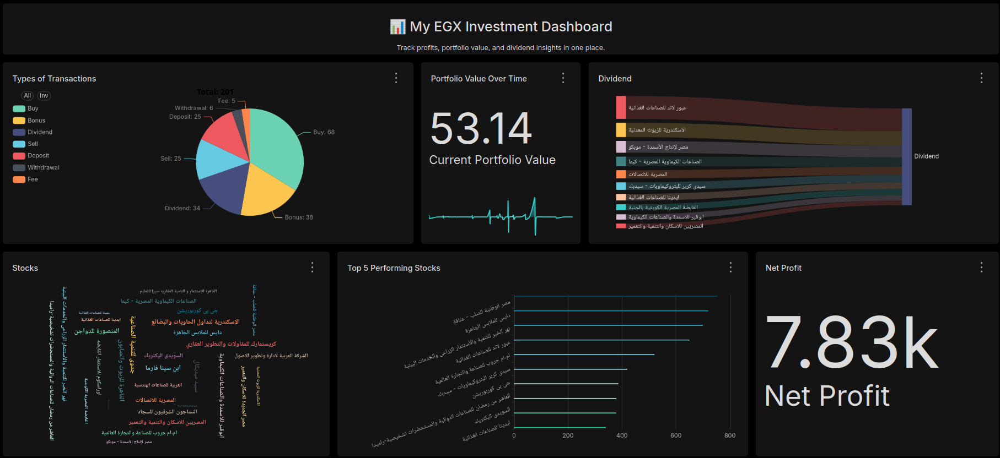

# My Stock Monitor

---

**MyStockMonitor** is a personal project designed to analyze and track my investments in the Egyptian Stock Exchange (EGX). It helps me measure my financial performance over time, monitor portfolio growth, and evaluate investment decisions using structured data and lightweight analytics.

This project serves both as a tool for personal financial insight and a technical exercise in data handling, automation, and visualization.

---

## Data Engineering Process

As a core part of this project, a robust data engineering process was established to ensure data quality, consistency, and readiness for analysis and visualization. This involved:

* **Data Ingestion & Collection:** Sourcing raw transactional data from various operational records and consolidating it into a unified format. This step focuses on capturing all financial activities, including buys, sells, dividends, fees, and cash movements.
* **Data Cleaning & Preprocessing:** Implementing custom scripts (primarily using **Python** with **Pandas**) to clean and standardize the raw input. This includes:
    * **Parsing Complex Descriptions:** Extracting structured information (e.g., share quantity, price per share, company name, instrument code) from free-form Arabic text descriptions.
    * **Standardizing Entity Names:** Harmonizing company names and transaction types to ensure consistency across the dataset, addressing variations and aliases.
    * **Handling Missing or Inconsistent Values:** Implementing logic to manage and impute any missing data points or correct inconsistencies.
* **Data Transformation & Structuring:** Transforming the cleaned data into a well-defined, analytical structure (CSV format). This involves:
    * **Feature Engineering:** Deriving new, valuable features such as transaction `Direction` (Inflow/Outflow) and classifying `Type` (Buy, Sell, Dividend, Deposit, etc.) from the raw descriptions.
    * **Data Type Enforcement:** Ensuring that numerical fields like `CashFlow`, `Quantity`, and `pricePerShare` are correctly parsed and stored with appropriate data types for accurate calculations.
* **Data Storage & Management:** Maintaining the processed data in a structured **CSV** format, facilitating easy loading into analytical tools like **Apache Superset** and enabling efficient querying via **SQL**.
* **Automation (Planned/Ongoing):** Developing (or planning to develop) **Shell scripting (Bash)** to automate the end-to-end data processing workflow, from raw data input to the generation of the final analytical dataset.

---

## Features

-   Organizes and stores personal investment records in CSV format.
-   Parses and processes transaction history, including:
    -   Buys / Sells
    -   Dividends
    -   Fees / Taxes
    -   Deposits / Withdrawals
    -   Subscriptions / Bonus shares
-   Calculates profit/loss over custom time ranges.
-   Generates summaries of current holdings and market value.
-   Builds interactive dashboards using Apache Superset.

---

## Used Tools & Technologies

| Category      | Tools/Technologies                      |
| :------------ | :-------------------------------------- |
| Programming   | **Python**, **Shell scripting (Bash)** |
| Data Handling | **CSV**, **Pandas**, **SQL** |
| Visualization | **Apache Superset** |
| Development   | **Git**, **GitHub**, **Docker** |
| Environment   | Ubuntu Linux, Neovim                    |

---
## Notes

-   This is a private project for personal financial tracking and technical development.
-   Data is real but will remain private. Shared files (if any) are anonymized or simulated.
-   The project is under continuous development and refactoring.

---

## ⚠️ Disclaimer:

The data used in this project reflects my real historical investments on the Egyptian Stock Exchange (EGX). However, **shared datasets (e.g., `sample_transactions.csv`, `sample_portfolio_holdings.csv`) contain synthetic (mock) data, not real financial figures, to protect privacy.** These datasets are shared for educational and technical purposes only, demonstrating the structure and type of data processed by the project.
